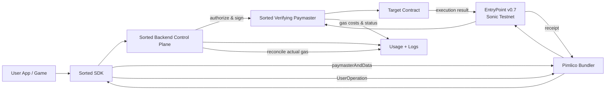

# Architecture & Lifecycle

The Sorted.fund stack keeps the sponsored transaction path predictable: SDK → backend control plane → Pimlico bundler → Sonic EntryPoint → Sorted paymaster → target contract. Every sponsored call includes a backend-signed `paymasterAndData` that encodes the scope of what the paymaster is allowed to fund.

## Full Sponsored Lifecycle

## Component Responsibilities

* **Sorted SDK** handles API key authentication, calls `/sponsor/authorize`, auto-retries transient errors, and normalizes Pimlico `eth_sendUserOperation` responses.
* **Backend Control Plane** manages projects, API keys, gas tanks, allowlists, caps, and kill switches. It emits paymaster authorization payloads (signature + policy hash + expiry + max cost) consumed by the on-chain paymaster.
* **Pimlico Bundler** is our hosted relayer. It accepts `eth_sendUserOperation`, `eth_estimateUserOperationGas`, and status queries using a Pimlico API key created via their CLI/dashboard workflow.
* **EntryPoint v0.7** (Sonic testnet) is the canonical verifier. Its address `0x0000000071727de22e5e9d8baf0edac6f37da032` is hard-coded into the paymaster.
* **Sorted Verifying Paymaster** enforces EntryPoint-only calls, allowlists (target + selector), max gas/cost per UserOp, backend signature validity, and kill switches (global/project/chain).

## Observability Loop

Every sponsored flow logs:

1. Authorization request (selector, estimated gas, project state).
2. `paymasterAndData` issuance (policy hash, expiry, signature).
3. Bundler submission result (hash, status).
4. EntryPoint/paymaster reconciliation (actual gas, refund, failure reason).

This timeline provides the audit trail required by DevRel and ensures we can detect unauthorized or over-budget execution paths quickly.

