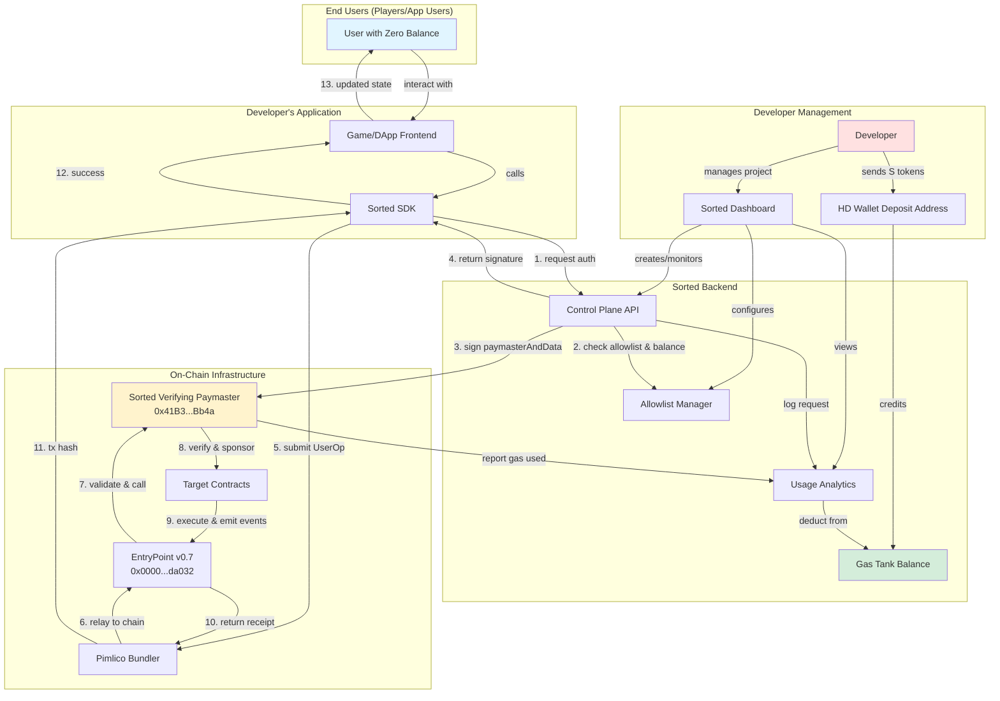
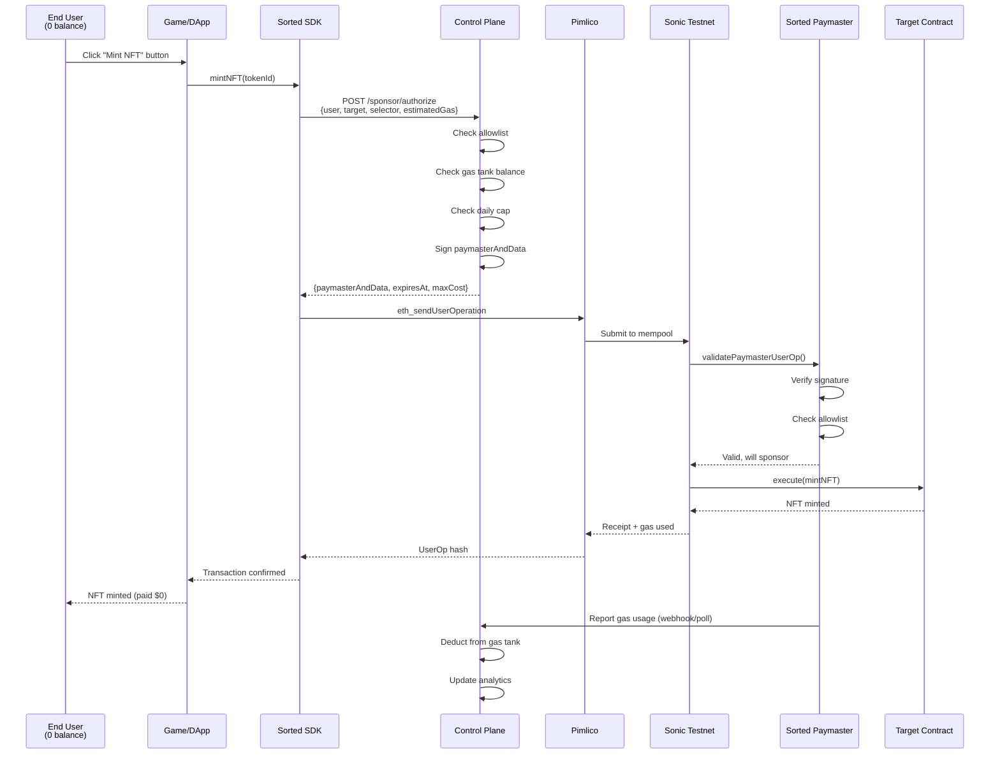
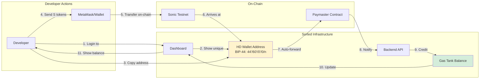

# Architecture & Lifecycle

## What is Sorted.fund?

Sorted.fund is a gasless transaction infrastructure for Sonic testnet. It allows developers to sponsor gas fees for their users, enabling true zero-friction onboarding—no wallets, no tokens, no gas fees required.

**For Developers:**
1. Create a project on the Sorted dashboard
2. Fund your gas tank by sending S tokens to your unique deposit address
3. Add one line of code to your app: `import { SortedClient } from '@sorted/sdk'`
4. Your users can now interact with your smart contracts without paying gas

**For End Users:**
- Click buttons, mint NFTs, play games—all with zero balance
- No crypto wallet setup, no buying tokens, no transaction fees
- Instant, seamless blockchain interactions that feel like Web2

**The Stack:**
The Sorted.fund stack keeps the sponsored transaction path predictable: SDK → backend control plane → Pimlico bundler → Sonic EntryPoint → Sorted paymaster → target contract. Every sponsored call includes a backend-signed `paymasterAndData` that encodes the scope of what the paymaster is allowed to fund.

## Complete System Architecture

## Full Sponsored Transaction Lifecycle

## Developer Funding Workflow

**Funding Flow Details:**
1. Each project gets a unique HD wallet-derived deposit address (BIP-44 path: `44'/60'/0'/0/{projectIndex}`)
2. Developer sends S tokens to their project's deposit address
3. Backend detects deposit via Alchemy webhooks + backup poller
4. Funds automatically forwarded to paymaster contract
5. Gas tank balance credited in database
6. Dashboard shows updated balance in real-time

## Component Responsibilities

* **End Users** interact with games/dApps without needing crypto wallets or gas tokens. Transactions appear instant and free.
* **Developers** integrate Sorted SDK into their apps, manage allowlists via dashboard, and fund their gas tank by sending S tokens to their unique deposit address.
* **Sorted Dashboard** provides project management, API key generation, allowlist configuration, analytics viewing, and gas tank balance monitoring.
* **HD Wallet Deposit Addresses** are deterministically generated per-project using BIP-44 standard (path: `44'/60'/0'/0/{index}`). One master mnemonic derives all project addresses.
* **Sorted SDK** handles API key authentication, calls `/sponsor/authorize`, auto-retries transient errors, and normalizes Pimlico `eth_sendUserOperation` responses.
* **Backend Control Plane** manages projects, API keys, gas tanks, allowlists, caps, and kill switches. It emits paymaster authorization payloads (signature + policy hash + expiry + max cost) consumed by the on-chain paymaster.
* **Pimlico Bundler** is our hosted relayer. It accepts `eth_sendUserOperation`, `eth_estimateUserOperationGas`, and status queries using a Pimlico API key created via their CLI/dashboard workflow.
* **EntryPoint v0.7** (Sonic testnet) is the canonical verifier. Its address `0x0000000071727de22e5e9d8baf0edac6f37da032` is hard-coded into the paymaster.
* **Sorted Verifying Paymaster** enforces EntryPoint-only calls, allowlists (target + selector), max gas/cost per UserOp, backend signature validity, and kill switches (global/project/chain).

## Observability Loop

Every sponsored flow logs:

1. Authorization request (selector, estimated gas, project state).
2. `paymasterAndData` issuance (policy hash, expiry, signature).
3. Bundler submission result (hash, status).
4. EntryPoint/paymaster reconciliation (actual gas, refund, failure reason).

This timeline provides the audit trail required by DevRel and ensures we can detect unauthorized or over-budget execution paths quickly.

